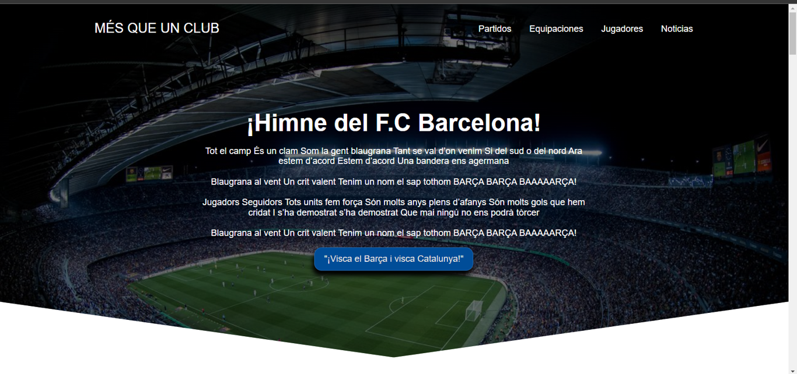

# FC Barcelona · Landing page

Landing page temática del **FC Barcelona** con historia del club, nuevas equipaciones, fichajes y preguntas frecuentes. Fue mi **primer proyecto web**, hecho de forma autodidacta para practicar maquetación responsive y JavaScript en el DOM.


[](https://juan-roserodev.github.io/fc-barcelona-landing-page/)

### 🔗 [Ver demo en vivo](https://juan-roserodev.github.io/fc-barcelona-landing-page/)



---

## ✨ Características

- Sección principal (*hero*), historia del club y equipaciones de la temporada.
- **Slider de fichajes** con controles anterior/siguiente.
- **Preguntas frecuentes** en formato acordeón con animación de altura.
- **Menú de navegación móvil** desplegable.
- Etiquetas **Open Graph** y **Twitter Card** para una vista previa correcta al compartir el enlace.

## 🛠️ Stack tecnológico

- **HTML5** semántico
- **CSS3**: Flexbox, Grid, media queries y `normalize.css`
- **JavaScript (ES6)**: manipulación del DOM y eventos

## 🗂️ Estructura

```
fc-barcelona-landing-page/
├── index.html
├── CSS/        # estilos.css, normalize.css
├── JS/         # menu.js, sliders.js, questions.js
└── IMAGENES/
```

## 🚀 Uso local

```bash
git clone https://github.com/juan-roserodev/fc-barcelona-landing-page.git
```

Abre `index.html` en el navegador. No necesita dependencias.

## 📌 Nota

Proyecto de práctica sin fines comerciales. Los nombres, escudos e imágenes del FC Barcelona pertenecen a sus respectivos dueños.

## 👤 Autor

**Juan David Rosero Reyes** · [Portafolio](https://juan-roserodev.github.io/) · [LinkedIn](https://www.linkedin.com/in/david-reyes-dev)
